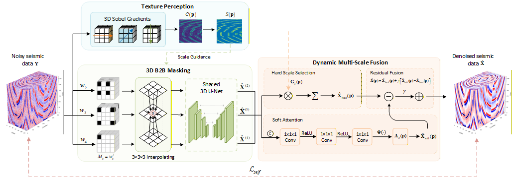

# SAM-B2B: A Spatially Adaptive Multiscale B2B Network for Self-Supervised 3D Seismic Denoising

## 📖 Overview

Self-supervised 3D seismic data denoising often struggles with complex spatial noise dependencies. Existing 1D or 2D blind-spot methods fail to effectively disrupt these 3D noise correlations. Furthermore, conventional fixed-scale masking mechanisms struggle to accommodate the varying texture complexities of real-world geological structures, resulting in either over-smoothing of fine details (like faults) or residual noise in flat sedimentary layers.

To address this, we propose **SAM-B2B**, a novel spatially adaptive multiscale Block-to-Block network. We innovatively extend the blind-spot concept into 3D space to effectively disrupt spatial noise dependencies. Driven by local texture complexity (quantified via 3D gradients), our framework utilizes an **Adaptive Multiscale Masking** scheme to dynamically allocate appropriate mask scales. Finally, an **Adaptive Residual Fusion** module softly integrates features across different scales using a lightweight attention mechanism, achieving high-precision denoising while preserving subtle geological features.

<br>
<p align="center">
  
</p>
<br>

## 🗂️ Repository Structure

To highlight the main academic contributions, this repository provides a **clean, minimal implementation** stripped of heavy engineering boilerplate (e.g., complex loggers, dataset wrappers).

```text
├── models.py         # Core network architectures (3D U-Net backbone & Adaptive Residual Fusion)
├── masking.py        # 3D complexity analyzer and dynamic multiscale blind-spot mask generation
├── train_minimal.py  # Minimal training pipeline demonstrating the core SAM-B2B mechanism
└── requirements.txt  # Project dependencies
```

## ⚙️ Installation & Dependencies

Ensure you have Python 3.8+ and PyTorch 1.10+ installed.

```# Core dependencies
pip install torch>=1.10.0 numpy>=1.20.0
```

## 🚀 Usage

You can directly run the minimal training pipeline. This script demonstrates how
the 3D complexity analysis, adaptive multiscale masking, and residual fusion
work together end-to-end using dummy seismic data tensors.

```# Execute the minimal training pipeline
python train_minimal.py
```

